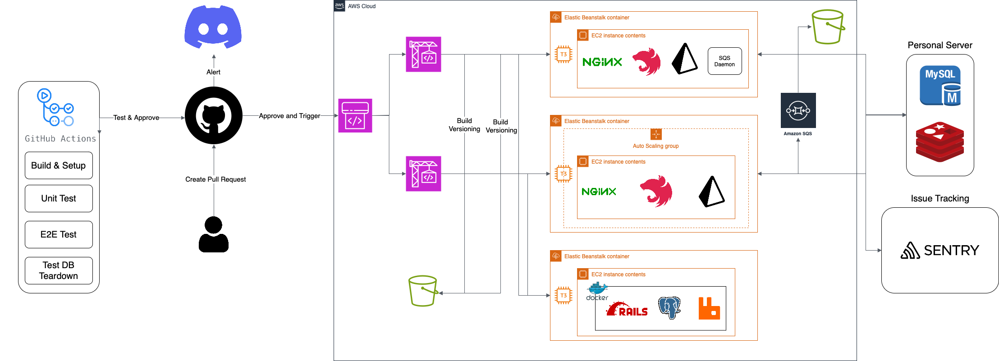

# Online Judge System API

- Author: J-Hoplin
- Team
  - J-Hoplin: Backend & Infrastructure
  - Oseungkwon: Frontend

## Contents

- [🔖 Diagram](#diagram)
- [📊 Test Coverage](#test-coverage)
- [🧰 Technical Stack](#technical-stack)
- [✅ Run Application](#run-application)
- [📄 Run E2E Test](#run-e2e-test)
- [📄 Run Unit Test](#run-unit-test)
- [📝 TODO](#todo)

## Diagram



## Frontend Repository

- Author: Oseungkwon
- [Repository](https://github.com/OseungKwon/Online-Judge-System-Web)

## Test Coverage

- E2E Test: 88.12%
- Unit & Integration Test: 79.13%

## Technical Stack

- Language
  - TypeScript(Node.js v18 Runtime)
- Framework
  - Nest.js
- ORM
  - Prisma ORM
- Database(Persistence & Caching)
  - MySQL 8.0
  - Redis
  - AWS S3
- Issue Tracking
  - Sentry
- Proxy Server
  - Nginx
- Infrastructure
  - Docker & Docker-Compose
  - AWS Elastic Beanstalk(EC2 Instance)
    - Node.js Runtime x2 (Worker Server & Web Server)
    - Docker Runtime x1
    - AWS Worker Communication
  - AWS Auto Scaling Group
  - AWS SQS: For worker server
  - AWS S3: Build Versioning
- Test
  - Jest
  - Jest-Extended
- CI/CD
  - Github Actions
  - Code Pipeline & Code Build
- Alert
  - Discord

## Run Application

1. Git clone repository

   ```
   git clone https://github.com/J-Hoplin/Online-Judge-System.git

   cd Online-Judge-System
   ```

2. Install dependencies

   ```
   yarn install
   ```

3. Run/Stop database with docker

   ```
   # Start
   yarn db:dev:up
   ```

   ```
   # Stop
   yarn db:dev:down
   ```

4. Sync prisma schema to database

   ```
   yarn db:push
   ```

5. Run application

   ```
   yarn dev
   ```

## Run E2E Test

- Config: test/jest-e2e.json
- Mock Provider: test/mock.provider.ts

1. Run database

   ```
   yarn db:dev:up
   ```

2. Initialize test database

   ```
   yarn test:init
   ```

3. Run E2E Test

   ```
   yarn test:e2e
   ```

4. Run E2E Coverage Test

   ```
   yarn test:e2e:cov
   ```

## Run Unit Test

- Config: test/jest-unit.json
- Mock Provider: test/mock.provider.ts

1. Run database

   ```
   yarn db:dev:up
   ```

2. Initialize test database

   ```
   yarn test:init
   ```

3. Run E2E Test

   ```
   yarn test:unit
   ```

4. Run E2E Coverage Test

   ```
   yarn test:unit:cov
   ```

## TODO

- [ ] Apply Strategy Pattern to Asynchronous Worker
  - Use Nest.js Custom Provider
  - Rabbit MQ Strategy & AWS SQS Strategy
- [ ] Make Online Judge Server with Golang
  - Now using [Judge0](https://judge0.com) based custom server
